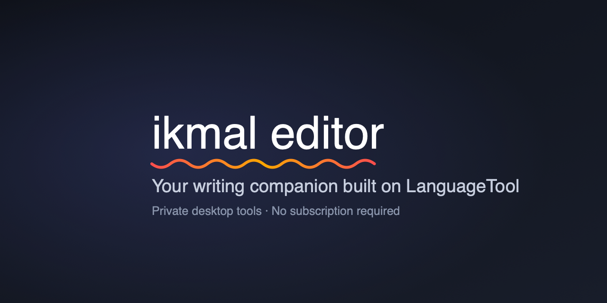

# Ikmal Editor — Launch Manager for LanguageTool

<p align="center">
  
</p>

<p align="center">
  <a href="https://go.dev"></a>
  <a href="LICENSE"></a>
  <a href="https://github.com/timeworthymedia/ikmal-editor"></a>
  <a href="https://dev.languagetool.org/"></a>
</p>

* **GitHub Repository**: [https://github.com/timeworthymedia/ikmal-editor](https://github.com/timeworthymedia/ikmal-editor)
* **Official LanguageTool Documentation**: [https://dev.languagetool.org/](https://dev.languagetool.org/)

**`ikmal-editor`** is a standalone, single-binary Go CLI supervisor, manager, and 1-click background server installer for [LanguageTool](https://dev.languagetool.org/).

It automates environment detection, embeds custom **Plain English & Syntactic Conciseness XML Rule Packs**, auto-downloads Meta's FastText language identification models, and configures persistent background daemons on macOS, Linux, and Windows.

> *Ikmal Editor is an independent third-party tool. It is not affiliated with, endorsed by, or sponsored by LanguageTooler GmbH. LanguageTool is a registered trademark of LanguageTooler GmbH. ([full disclaimer](#acknowledgements--open-source-attribution))*

---

## Requirements

- **Java 17+ or Docker** — LanguageTool itself runs on the JVM. `ikmal-editor` auto-detects a Homebrew, Docker, or system Java install and will not start a server without one.
- **~350MB of disk** — the LanguageTool distribution and Meta's FastText `lid.176.bin` model are downloaded to `~/.ikmal-editor/` on first run.
- **Optional quality model** — `--quality-setup` adds roughly 310MB for the
  quantized grammar model and about 340MB for the managed Node.js runtime/cache.
  It is opt-in.

The `ikmal-editor` binary itself is built from the Go standard library only and has no third-party module dependencies. The optional transformer adapter is a separately managed Node.js/ONNX process.

---

## Why Ikmal Editor?

While LanguageTool provides powerful HTTP server capabilities, setting up a local server requires managing Java JREs, long command-line flags, CORS headers, FastText model paths, and manual background daemons.

`ikmal-editor` operates as an independent supervisor that detects your local environment and launches a fully configured, production-ready LanguageTool server on port `8097`.

| Feature | Standard Manual Setup | Ikmal Editor |
|---|---|---|
| **One-Command Launch** | Manual `java -jar` commands or Docker YAML | **Single binary** auto-detects Homebrew, Docker, or Java |
| **Plain English Conciseness** | Stock grammar rules only | **Embedded XML Rule Pack** (30+ rules from PlainLanguage.gov & Vale) |
| **FastText Model Download** | Manual 120MB download from Meta FTP | **Auto-downloads** `lid.176.bin` to `~/.ikmal-editor/models/` |
| **Persistent Service** | Requires keeping terminal window open | **Auto-installs background macOS LaunchAgent / systemd / Windows daemon `[BETA]`** |
| **CORS for Web Extensions** | Manual `--allow-origin` flags | Pre-configured `--allow-origin *` on port `8097` |

---

## Independent Package Manager & Version Updates

`ikmal-editor` operates as a **transparent supervisor and configuration manager**:

- **Homebrew (`brew upgrade`)**: When you update LanguageTool via Homebrew (`brew upgrade languagetool`), Homebrew updates the core LanguageTool engine binary independently. `ikmal-editor` detects the updated binary and launches it automatically without requiring changes to your daemon.
- **Raspberry Pi (ARM64 & ARMv7)**: Pre-compiled `linux-arm64` and `linux-armv7` binaries for 1-click execution on Raspberry Pi 3, 4, and 5.
- **Unraid Home Server**: Add template URL `https://raw.githubusercontent.com/timeworthymedia/ikmal-editor/main/unraid/my-ikmal-editor.xml` in Unraid Community Applications.
- **Docker (`docker pull`)**: Containerized LanguageTool images are updated independently via standard Docker image pulls.
- **APT (`sudo apt upgrade`)**: Linux system packages update independently via standard `apt` package management.
- **Standalone Java JAR**: `ikmal-editor` fetches official releases directly from `org.languagetool.org`.

---

## Update Checks & Privacy

`ikmal-editor` runs entirely on your machine. **Your text is never sent anywhere** — the LanguageTool server it manages listens on `127.0.0.1:8097` and nothing leaves the loopback interface.

The one outbound request the binary makes on its own is a **daily update check**: it fetches a static JSON file over HTTPS and tells you if a newer release exists.

- It sends **no identifier** — no UUID, no hostname, no username, no OS or hardware details. There is no request body and no query string.
- It stores **only a timestamp** (`~/.ikmal-editor/.update-check`) to rate-limit itself to once every 24 hours.
- It **fails silently** and never blocks startup (3-second timeout, runs after the server is already up).

Turn it off either way:

```bash
ikmal-editor -no-update-check          # per run
export IKMAL_EDITOR_NO_UPDATE_CHECK=1  # permanently
```

Aggregate download counts come from the GitHub Releases API, not from the binary.

---

## Quick Start

### Option A: Install via Homebrew (macOS & Linux)

```bash
# 1. Tap the official Time Worthy Media repository
brew tap timeworthymedia/tap

# 2. Install Ikmal Editor
brew install timeworthymedia/tap/ikmal-editor

# 3. Auto-configure Chrome, Firefox, Safari, Apple Mail, Word, & VSCode
ikmal-editor -configure-apps
```

### Option B: Build from Source

```bash
# 1. Clone the repository
git clone https://github.com/timeworthymedia/ikmal-editor.git
cd ikmal-editor

# 2. Build & launch server manager (auto-configures background server & apps)
go build -o ikmal-editor .
./ikmal-editor

# Optional: start LanguageTool, the local quality model, and the browser proxy together
./ikmal-editor --integrated

# 3. Auto-configure Chrome, Firefox, Safari, Apple Mail, Word, & VSCode
./ikmal-editor -configure-apps

# 4. Clean 1-click uninstall (purges daemon, stops services, clears data)
./ikmal-editor -uninstall
```

---

## Optional Writing Quality Sidecar

The opt-in quality sidecar runs locally on port `8098` and currently provides
deterministic paragraph-window repetition, word-family echo, and conservative
pronoun–antecedent analysis. It does not send text anywhere. A separate,
optional Transformers.js/ONNX adapter can add local transformer suggestions
through the same sidecar.

```bash
./ikmal-editor --quality-server
```

Check it with:

```bash
curl http://127.0.0.1:8098/health
curl -X POST http://127.0.0.1:8098/v1/analyze \
  -H 'Content-Type: application/json' \
  -d '{"text":"Plants produce its own food."}'
```

The response includes inline suggestions and antecedent links. To enable the
optional transformer adapter, use the managed setup command:

The Go launcher installs the Transformers.js/ONNX adapter under
`~/.ikmal-editor/quality/`, caches the model under `~/.ikmal-editor/models/`,
and preloads the model when Node.js and npm are available:

```bash
./ikmal-editor --quality-setup
```

The setup downloads the quantized `Xenova/t5-base-grammar-correction` model
only when explicitly run; it is not downloaded during normal LanguageTool
startup.

Transformer analysis is chunked locally instead of sending whole pages to the
model. It groups sentences up to 80 words by default and preserves document
offsets. Adjust with `IKMAL_TRANSFORMER_MAX_CHUNK_WORDS` if needed.

Then start the Go sidecar in another terminal:

```bash
./ikmal-editor --quality-server --quality-transformer
```

To expose both LanguageTool and the quality checks through the API used by
browser extensions, start the compatibility proxy:

```bash
./ikmal-editor --quality-proxy --quality-transformer
```

Configure the Chrome LanguageTool extension to use:

```text
http://127.0.0.1:8096/v2
```

The proxy forwards native LanguageTool matches from port `8097`, adds quality
matches from port `8098`, removes duplicate edits, and resolves overlaps by
preferring native LanguageTool results or a broader quality correction that
contains a narrower one.

That command starts the managed Transformers.js adapter automatically and
shuts it down with the Go sidecar. Set `IKMAL_QUALITY_FORCE_SETUP=1` to
refresh the managed installation before starting it.

Run the regression corpus against the gateway with:

```bash
node quality_eval.mjs
```

The model remains local after download. See [`QUALITY.md`](QUALITY.md) for the
model-sidecar contract and rollout roadmap.

## Style Guides

Import a local PDF, basic HTML page, Markdown file, or text list into the
managed style-guide catalog:

```bash
./ikmal-editor --style-guide-import ./company-style-guide.pdf
./ikmal-editor --style-guide-import https://example.com/your-style-guide/
./ikmal-editor --style-guide-list
./ikmal-editor --style-guide-use company-style-guide
./ikmal-editor --style-guide-enable
./ikmal-editor --style-guide-disable
./ikmal-editor --style-guide-current
```

PDF import uses the optional `pdftotext` command from Poppler. Imported
guidance remains local under `~/.ikmal-editor/style-guides/`. Selecting a guide
sets the default, while `--style-guide-enable` activates its generated XML
rules as an optional extra layer on the next LanguageTool restart. Disable it
again when you want baseline checking only.

An `http://` or `https://` source is crawled across same-site links within the
guide path and merged into one catalog. External links, assets, and unrelated
site paths are skipped. Use a guide’s canonical landing page when importing a
multi-page HTML guide.

Each PDF import also creates a human-review CSV beside the guide. It includes
the extracted source text, page number, inferred rule type, optional
replacement pair, confidence, notes, and a `draft` status. Open that file in a
spreadsheet editor, correct or complete the rows, change approved rules to
`approved`, and import it with `--style-guide-rules-import` below. Re-importing
the PDF preserves an existing review file so editorial changes are not lost.
If the source PDF changes and the review file should be regenerated, use
`--style-guide-review-refresh <source>` explicitly.

Before activating an edited review file, run the deterministic lint pass:

```bash
./ikmal-editor --style-guide-review-lint <guide-id>
```

If the edited file is a separate draft (including the CSV produced by the
optional enrichment step), install it as the guide's canonical review file
only after it passes lint:

```bash
./ikmal-editor --style-guide-review-activate <guide-id> ./review.csv
```

Explicit rules can be reviewed or generated with an LLM as CSV, then imported
for a particular guide:

```bash
./ikmal-editor --style-guide-rules-import <guide-id> ./rules.csv
```

The basic CSV columns are `id`, `kind`, `match`, `replacement`, and `status`;
optional columns include `name`, `confidence`, `alternatives`, `scope`,
`message`, `example`, and `correction`:

```csv
id,kind,match,replacement,status
spell-out-us,hard_replacement,United States,U.S.,approved
prefer-video-game,contextual_preference,games,video games,approved
```

Only `approved` `hard_replacement` rows become LanguageTool XML. When the
guide is enabled, the quality sidecar also reads approved
`contextual_preference` and `do_not_equate` rows from the canonical review CSV.
Draft and disabled rows are ignored, and near-synonyms are not silently
treated as interchangeable. Rules and generated XML are stored under
`~/.ikmal-editor/style-guides/`, outside the repository.

For optional LLM assistance, export a JSONL work queue and a strict prompt:

```bash
./ikmal-editor --style-guide-review-export <guide-id>
```

Give the generated `*.enrichment-input.jsonl` and `*.enrichment-prompt.md` to
the model, save its one-JSON-object-per-line response, and merge it into a new
draft review CSV:

```bash
./ikmal-editor --style-guide-review-enrichment-import <guide-id> ./model-output.jsonl
```

The merge never accepts model approval; every enriched row remains `draft`.

---

## Desktop app

The repository now includes a small Electron menubar shell under `desktop/`.
It manages the integrated Go services and provides a local writing tester
against the same endpoint used by the browser extension:

```bash
go build -o ikmal-editor .
cd desktop
npm install
npm start
```

The tray menu can start or stop the manager, and the writing panel shows full
suggested replacement text, related occurrences, and antecedent links. Build a
platform bundle with `npm run package`; release automation can select targets
with `IKMAL_DESKTOP_PLATFORM` and `IKMAL_DESKTOP_ARCH`.

---

## Browser Extensions & Add-ons Setup

> **Note**: `ikmal-editor` automatically configures settings for your installed applications and extensions, but **does not download browser extensions or office plug-ins automatically**. You are responsible for installing your preferred extension once from the official source.

Find official browser extensions and office plug-ins at:
- **[LanguageTool Plug-ins & Add-ons Directory](https://dev.languagetool.org/software-that-supports-languagetool-as-a-plug-in-or-add-on)**

Once installed, running `ikmal-editor -configure-apps` automatically routes your browser extensions to `http://127.0.0.1:8097/v2/check`.

---

## Official LanguageTool Documentation References

`ikmal-editor` strictly follows official LanguageTool specifications and APIs:

- **[Official LanguageTool Developer Documentation Portal](https://dev.languagetool.org/)**
- **[LanguageTool HTTP Server Documentation](https://dev.languagetool.org/http-server)**
- **[LanguageTool Development Overview](https://dev.languagetool.org/development-overview)**
- **[Software Supporting LanguageTool Plug-ins](https://dev.languagetool.org/software-that-supports-languagetool-as-a-plug-in-or-add-on)**

---

## Embedded Plain English & Conciseness XML Rule Pack

The manager embeds [`rules/style_conciseness.xml`](rules/style_conciseness.xml), compiled from [PlainLanguage.gov](https://www.plainlanguage.gov) and open-source style linters ([proselint](https://github.com/amperser/proselint), [write-good](https://github.com/btford/write-good)):

### Sample Rules Included:

- **Wordiness Reduction**:
  - *"in order to"* -> **"to"**
  - *"due to the fact that"* -> **"because"**
  - *"at this point in time"* -> **"now"**
  - *"in the event that"* -> **"if"**
- **Nominalization Reduction (Verbification)**:
  - *"make a decision"* -> **"decide"**
  - *"conduct an investigation into"* -> **"investigate"**
  - *"give consideration to"* -> **"consider"**
- **Redundancy Elimination**:
  - *"advance planning"* -> **"planning"**
  - *"end result"* -> **"result"**
- **Plain English Clarity**:
  - *"has the capability to"* -> **"can"**
  - *"utilize"* -> **"use"**

---

## Integrations

- **[Trilium Notes Plugin (`iansherr/trilium-languagetool`)](https://github.com/iansherr/trilium-languagetool)** `[Coming Soon]`: Connects Trilium's CKEditor note body editor directly to `http://127.0.0.1:8097/v2/check`.
- **Chrome & Firefox Web Extensions**: Point official LanguageTool browser extensions to `http://127.0.0.1:8097/v2/check` under Extension Options -> Local Server.

---

## What is Time Worthy Media?

Time Worthy Media is the studio behind Ikmal Editor. This project grew out of
my work building tools that make complicated systems easier to use in everyday
life. I design with a human-centered philosophy: software should be easy to
start, personalizable as people develop their own workflows, and helpful
without demanding that everyone become an expert first.

I believe everyone benefits from a little help. Ikmal Editor is one expression
of that belief—a local writing companion that gives people more clarity,
confidence, and control over their work.

---

## Acknowledgements & Open-Source Attribution

`ikmal-editor` is an independent open-source utility created to simplify local installation, process management, and browser/app auto-configuration for LanguageTool users.

* **Powered by LanguageTool**: All core grammar checking, spellchecking, and natural language processing engines are developed and maintained by the open-source [LanguageTool](https://dev.languagetool.org/) project created by Daniel Naber and the LanguageTool Community. We express our deep gratitude to the LanguageTool maintainers and contributors for their outstanding work.
* **Independent Project Disclaimer**: `ikmal-editor` is developed independently by [Time Worthy Media, LLC](https://timeworthymedia.com) and is not affiliated with, endorsed by, or sponsored by LanguageTooler GmbH. LanguageTool is a registered trademark of LanguageTooler GmbH.

---

## License & Copyright

MIT License Copyright (c) 2026 [Ian Sherr](https://iansherr.com) / [Time Worthy Media](https://timeworthymedia.com). All rights reserved.
